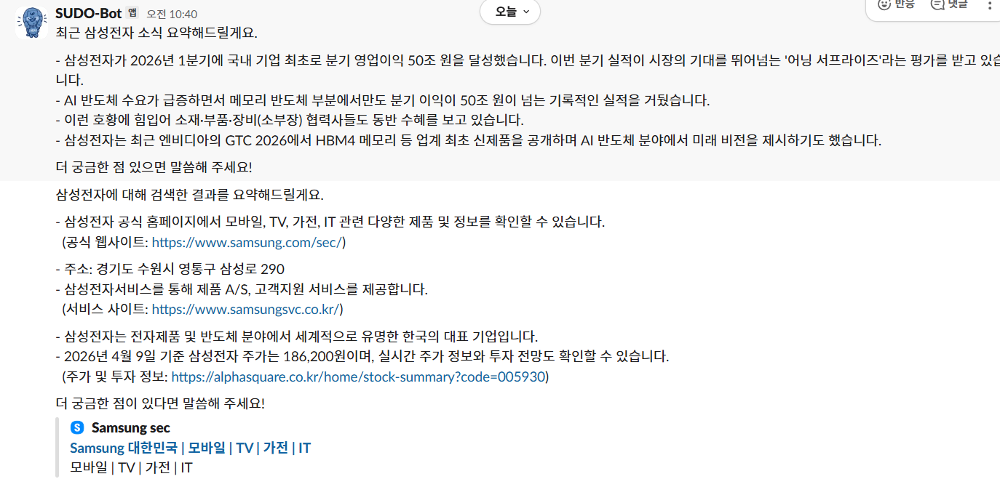
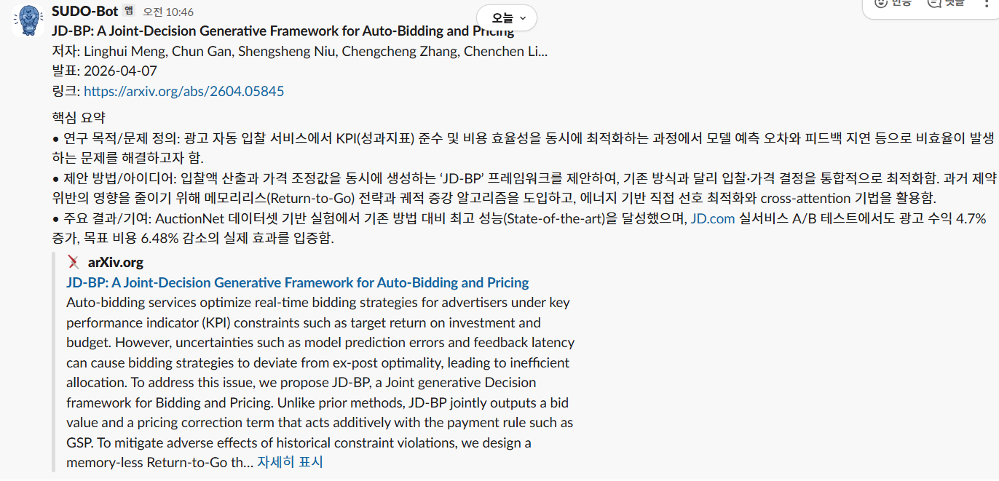
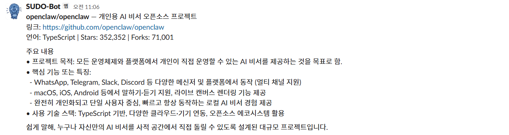
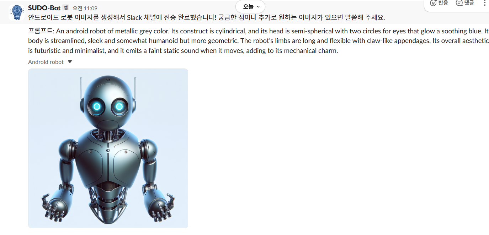
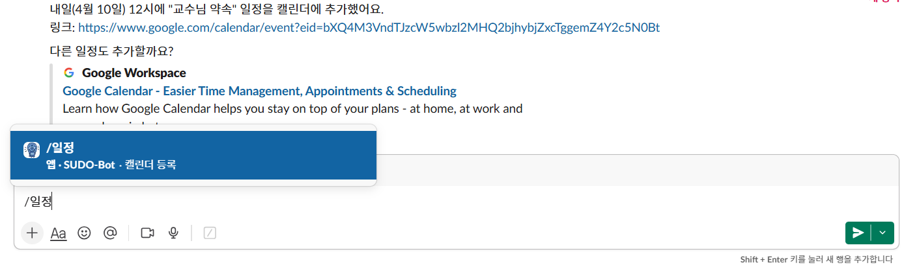

# SUDO Slack Agent

이 저장소는 **챗봇만들기 프로젝트 SUDO 1조의 결과물**로, Slack 환경에서 동작하는 멀티 툴 기반 AI 에이전트를 구현한 프로젝트입니다.  
사용자 질의에 따라 대화 응답뿐 아니라 일정 등록, 날씨 조회, 웹 검색, 논문/레포 요약, 이미지 생성, 공지 전송, 투표 생성까지 수행합니다.

## 프로젝트 개요

- **목표**: Slack 채널/DM에서 실사용 가능한 업무 보조형 AI 에이전트 제공
- **운영 방식**: Slack Socket Mode 기반 실시간 이벤트 처리
- **에이전트 구조**: LangChain 에이전트가 자연어 의도를 해석하고, 필요한 경우 도구를 선택 호출
- **주요 도메인**: 스터디/협업 운영 자동화(공지, 일정, 정보 탐색, 의사결정 지원)

## 핵심 기능

### 1) 대화형 에이전트 응답
- `@멘션` 및 DM 메시지에 대해 자연어 대화 응답
- 일반 질문/잡담은 도구 호출 없이 응답
- 세션별 `thread_id`를 사용해 대화 맥락 유지

### 2) Slack 슬래시 커맨드 지원
- `/날씨 [도시]`: 현재 날씨 조회
- `/검색 <검색어>`: DuckDuckGo 기반 웹 검색
- `/논문 <arXiv ID/URL>`: arXiv 논문 메타데이터/초록 조회 후 요약
- `/레포 <owner/repo 또는 URL>`: GitHub 저장소 정보/README 기반 요약
- `/이미지 <설명>`: DALL-E 3 이미지 생성 후 Slack 업로드
- `/투표 <질문 | 선택지1 | 선택지2 ...>`: 반응형 투표 메시지 생성
- `/일정 <자연어>`: Google Calendar 일정 생성
- `/공지 <내용>`: 지정 채널 공지 전송

### 기능별 화면

#### 프로젝트 대표 이미지


#### `/검색` 기능


#### `/논문` 기능


#### `/레포` 기능


#### `/이미지` 기능


#### `/일정` 기능


#### `/투표` 기능


### 3) 외부 서비스 연동 자동화
- **Google Calendar API**: OAuth 인증 기반 일정 생성
- **Open-Meteo API**: 도시 기반 현재 날씨 조회
- **DuckDuckGo(ddgs)**: 최신 정보 검색
- **arXiv API**: 논문 메타데이터/초록 수집
- **GitHub REST API**: 저장소 통계/README 수집
- **OpenAI API**: 대화 모델 + 이미지 생성 모델 사용
- **Slack Web API**: 메시지 전송, 파일 업로드, 반응 추가

## 에이전트/도구 설계

### 에이전트 구성
- 파일: `calendar-slack-agent/agent.py`
- 모델: `ChatOpenAI(model="gpt-4.1")`
- 체크포인터: `InMemorySaver`
- 시스템 프롬프트에서 도구 사용 정책을 명시:
  - 불필요한 도구 호출 최소화
  - 날씨/검색/일정/공지/투표/논문/레포/이미지 처리 규칙 정의
  - 결과는 한국어 중심으로 요약 제공

### 도구 모듈
- `tools/calendar_tool.py`: Google Calendar 일정 생성
- `tools/weather_tool.py`: Open-Meteo 기반 현재 날씨 조회
- `tools/search_tool.py`: DuckDuckGo 검색 결과 수집
- `tools/paper_tool.py`: arXiv 논문 메타데이터/초록 조회
- `tools/github_tool.py`: GitHub 저장소 정보 + README 프리뷰 조회
- `tools/image_tool.py`: DALL-E 3 이미지 생성 및 Slack 업로드
- `tools/slack_tool.py`: Slack 채널 메시지 전송
- `tools/poll_tool.py`: Slack 투표 메시지 작성 및 반응 추가

### Slack 런타임
- 파일: `calendar-slack-agent/slack_bot.py`
- 이벤트 처리:
  - `app_mention`: 멘션 기반 질의 처리
  - `message`(DM): 1:1 메시지 처리
- 슬래시 커맨드 핸들러:
  - `/날씨`, `/검색`, `/논문`, `/레포`, `/이미지`, `/투표`, `/일정`, `/공지`

## 기술 스택

### Language / Runtime
- Python 3.x

### LLM / Agent Framework
- LangChain
- LangChain OpenAI
- LangGraph (체크포인트/상태 관리 호환)
- OpenAI API (`gpt-4.1`, `dall-e-3`, 보조적으로 `gpt-4o`)

### Collaboration / Platform
- Slack Bolt (Socket Mode)
- Slack SDK (메시지/파일/리액션 API)

### External APIs
- Google Calendar API
- Open-Meteo API
- DuckDuckGo Search (`ddgs`)
- arXiv API
- GitHub REST API

### Utilities
- `python-dotenv`
- `requests`
- `pydantic`

## 디렉터리 구조

```text
kms/
├─ README.md
├─ requirements.txt
├─ calendar-slack-agent/
│  ├─ agent.py
│  ├─ slack_bot.py
│  ├─ stream_flow.py
│  ├─ requirements.txt
│  └─ tools/
│     ├─ calendar_tool.py
│     ├─ github_tool.py
│     ├─ image_tool.py
│     ├─ paper_tool.py
│     ├─ poll_tool.py
│     ├─ search_tool.py
│     ├─ slack_tool.py
│     └─ weather_tool.py
└─ legacy/
   └─ langchain_test.py
```

## 실행 방법

### 1) 의존성 설치
```powershell
cd c:\program-test\sudo-repo\kms\calendar-slack-agent
python -m venv .venv
.venv\Scripts\Activate.ps1
pip install -r requirements.txt
```

### 2) 환경 변수 설정 (`.env`)
필수:
- `OPENAI_API_KEY`
- `SLACK_BOT_TOKEN`
- `SLACK_APP_TOKEN`
- `SLACK_CHANNEL_ID`

선택:
- `GITHUB_TOKEN` (GitHub API Rate Limit 완화 목적)

### 3) Slack 앱 설정
- Socket Mode 활성화
- App-Level Token 발급 (`connections:write`)
- OAuth 스코프 예시:
  - `chat:write`
  - `app_mentions:read`
  - `im:history`
  - `reactions:write`
  - `files:write`
- 슬래시 커맨드 등록:
  - `/날씨`, `/검색`, `/논문`, `/레포`, `/이미지`, `/투표`, `/일정`, `/공지`

### 4) Google Calendar OAuth 파일 준비
- `credentials.json` 또는 `client_secret*.json`을 `calendar-slack-agent` 경로에 배치
- 최초 실행 시 OAuth 인증 후 `token.json` 자동 생성

### 5) 실행
```powershell
python slack_bot.py
```

## 운영 참고사항

- 민감 파일(`.env`, `token.json`, `client_secret*.json`)은 Git 추적에서 제외해야 합니다.
- 이미지 생성 기능은 OpenAI API 사용량 정책 및 과금 정책의 영향을 받습니다.
- 외부 API 장애/지연 상황에서는 도구별 예외 메시지가 반환될 수 있습니다.

## 라이선스

별도 명시 전까지는 프로젝트 참여자 내부 학습/실험 용도로 사용합니다.